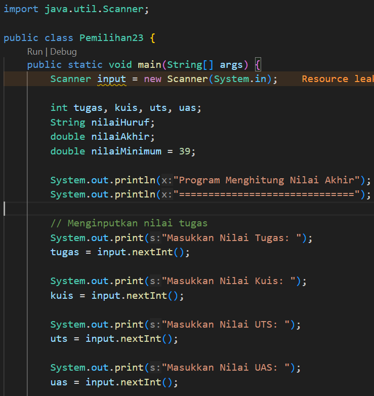
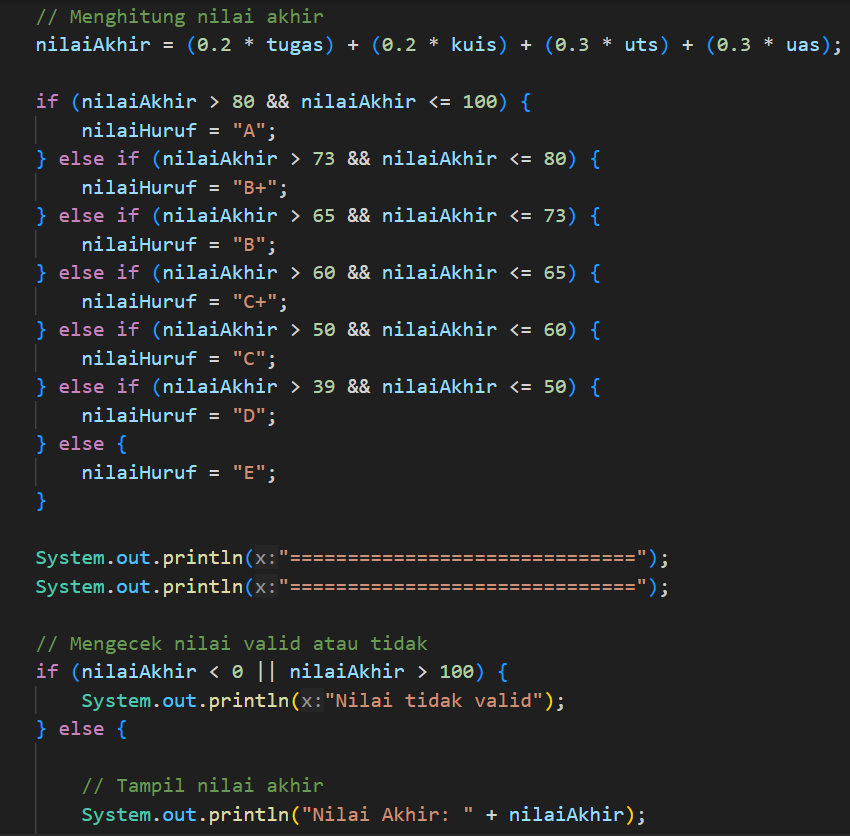
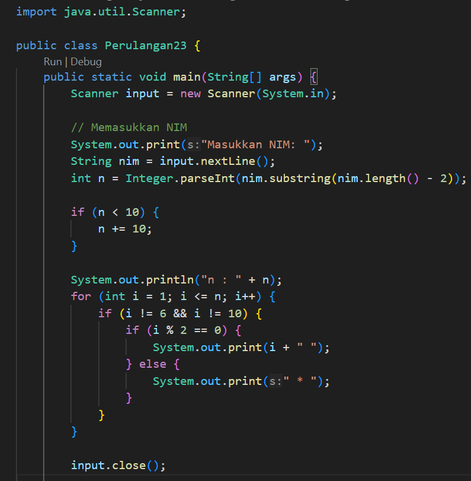
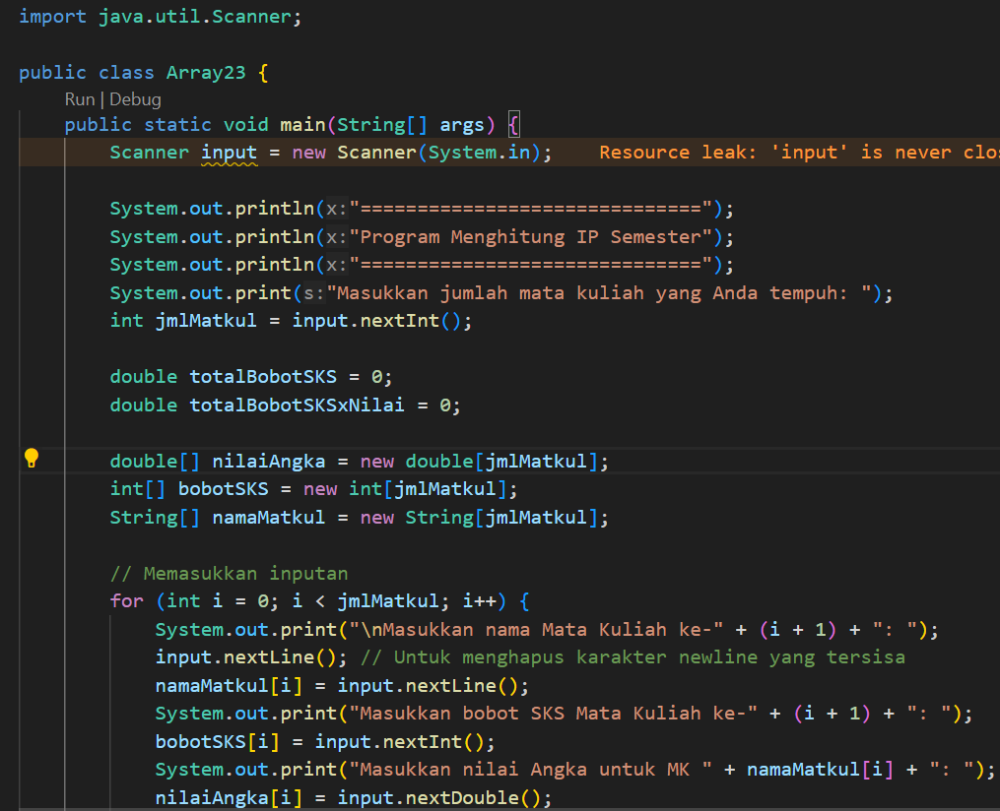
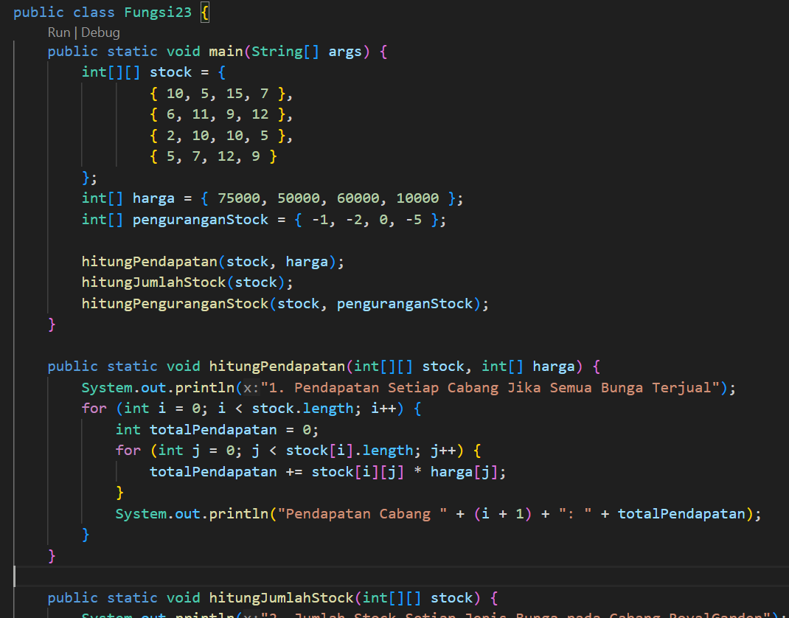
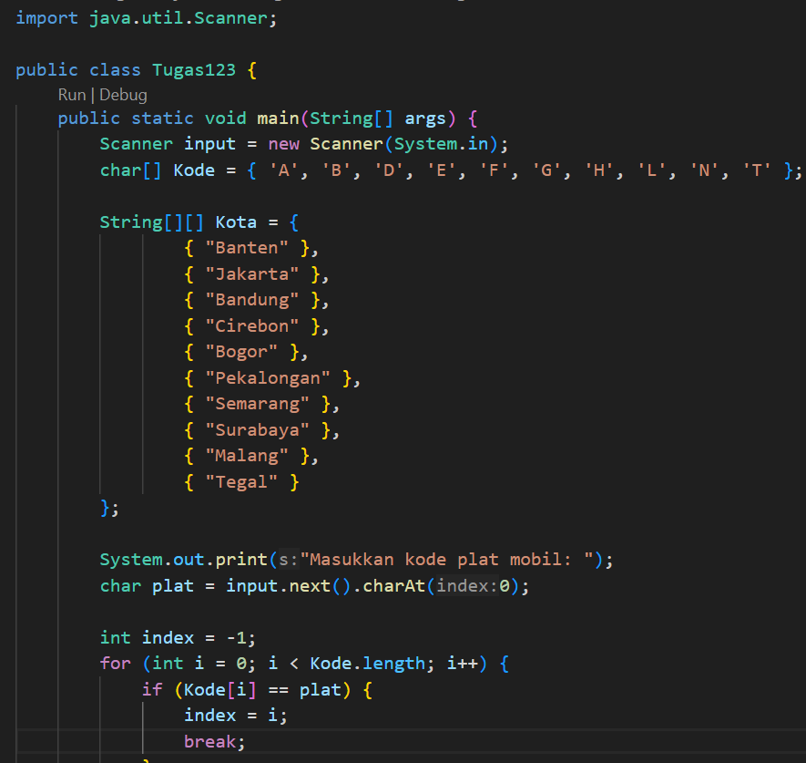
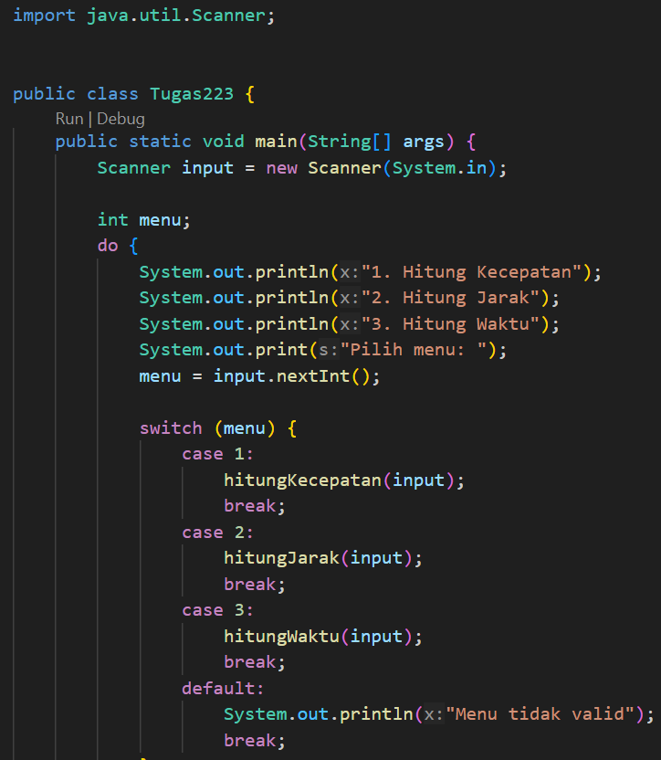

# 
 LAPORAN ALGORITMA DAN STRUKTUR DATA

     

     

 Nama       : REIKA AMALIA SYAHPUTRI 

 NIM        : 2341720173 

 Kelas / no : TI-1B / 23 

 Jurusan    : TEKNOLOGI INFORMASI 

## JOBSHEET I KONSEP DASAR PEMROGRAMAN

## 2.2.1 Praktikum Pemilihan 

## 2.3.1 Praktikum Perulangan 

## 2.4.1 Praktikum Array 

## 2.5.1 Praktikum Fungsi 

## TUGAS PRKTIKUM 1

NO 1 

NO 2 
