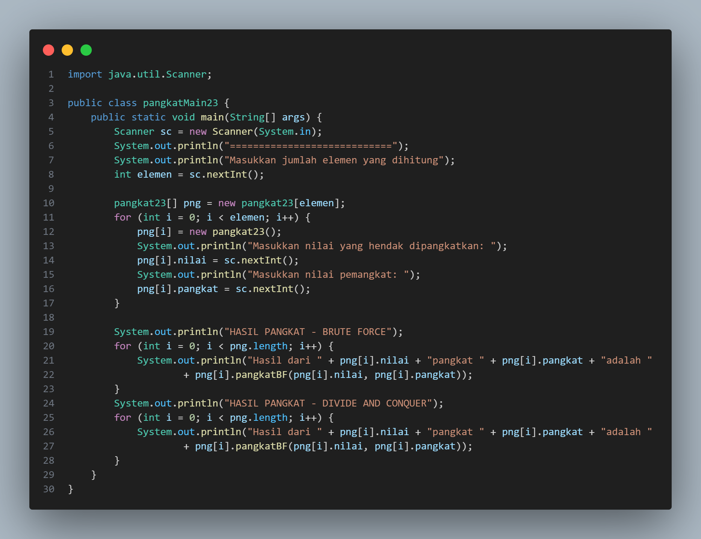

# 
 LAPORAN ALGORITMA DAN STRUKTUR DATA

     

     

 Nama       : REIKA AMALIA SYAHPUTRI 

 NIM        : 2341720173 

 Kelas / no : TI-1B / 23 

 Jurusan    : TEKNOLOGI INFORMASI 

## JOBSHEET IV BRUTE FORCE DAN DIVIDE CONQUER

Percobaan 1

code: 
 
main: 
 
output: 
 

4.2.3 Pertanyaan
1. Pada base line Algoritma Divide Conquer untuk melakukan pencarian nilai faktorial, jelaskan perbedaan bagian kode pada penggunaan if dan else! 
- penggunaan if dan juga else pada algoritma Divide and Conquer untuk menghitung faktorial membantu dalam menentukan langkah selanjutnya berdasarkan nilai n, if untuk menghentikan rekursi pada kasus dasar, jika else untuk melanjutkan rekursi dan memecah masalah menjadi dua bagian yng lebih kecil. 
2. Apakah memungkinkan perulangan pada method faktorialBF() dirubah selain menggunakan for?Buktikan! 
-  
3. Jelaskan perbedaan antara fakto *= i; dan int fakto = n * faktorialDC(n-1); ! 
- fakto *= i; digunakan untuk menghitung nilai faktorial secara langsung dengan perkalian berulang. Jika int fakto = n * faktorialDC(n-1); digunakan untuk menyimpan nilai faktorial yang dihitung secara rekursif. Jika nilai faktorial hanya dibutuhkan untuk satu kali perhitungan, maka fakto *= i; dapat digunakan. Jika nilai faktorial dibutuhkan untuk beberapa kali perhitungan atau di dalam fungsi rekursif, maka int fakto = n * faktorialDC(n-1); dapat digunakan.

Percobaan 2

code: 
 
main: 
 
output: 
 

4.3.3 Pertanyaan
1. Jelaskan mengenai perbedaan 2 method yang dibuat yaitu PangkatBF()dan PangkatDC()! 
- PangkatBF() :
menggunakan pendekatan langsung dengan melakukan iterasi sebanyak n kali, di mana n merupakan eksponen pangkat.
setiap iterasi, hasil pangkat dihitung dengan mengalikan bilangan asli dengan dirinya sendiri sebanyak kali sesuai dengan eksponen.
PangkatDc() :
menggunakan pendekatan rekursif dengan membagi permasalahan menjadi submasalah yang lebih kecil.
setiap langkah rekursif, pangkat dari setengah eksponen dihitung dan hasilnya dikuadratkan. 
2. Apakah tahap combine sudah termasuk dalam kode tersebut?Tunjukkan! 
-  
3. Modifikasi kode program tersebut, anggap proses pengisian atribut dilakukan dengan konstruktor. 
-  
 
4. Tambahkan menu agar salah satu method yang terpilih saja yang akan dijalankan menggunakan switch-case! 
-  

percobaan 3

code: 
 
main: 
 
output: 
 

4.4.3 Pertanyaan
1. Mengapa terdapat formulasi return value berikut?Jelaskan! 
- digunakan dalam metode Divide and Conquer untuk menghitung hasil pangkat dari setiap submasalah. Memungkinkan untuk menggabungkan hasil dari kedua submasalah dan menghitung hasil pangkat secara rekursif. Hasil pangkat dari kedua submasalah termasuk dalam perhitungan akhir, memastikan bahwa hasil pangkat akhir yang benar diperoleh.
2. Kenapa dibutuhkan variable mid pada method TotalDC()? 
- untuk menentukan elemen tengah dari array saat membagi masalah menjadi submasalah yang lebih kecil.
3. Program perhitungan keuntungan suatu perusahaan ini hanya untuk satu perusahaan saja.
Bagaimana cara menghitung sekaligus keuntungan beberapa bulan untuk beberapa
perusahaan.(Setiap perusahaan bisa saja memiliki jumlah bulan berbeda-beda)? Buktikan
dengan program! 
-  

Latihan
1. Sebuah showroom memiliki daftar mobil dengan data sesuai tabel di bawah ini
Tentukan:
a. top_acceleration tertinggi menggunakan Divide and Conquer!
b. top_acceleration terendah menggunakan Divide and Conquer!
c. Rata-rata top_power dari seluruh mobil menggunakan Brute Force!
