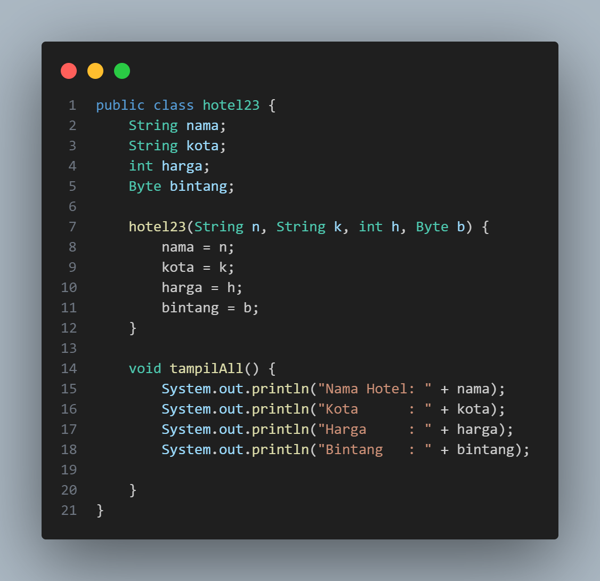
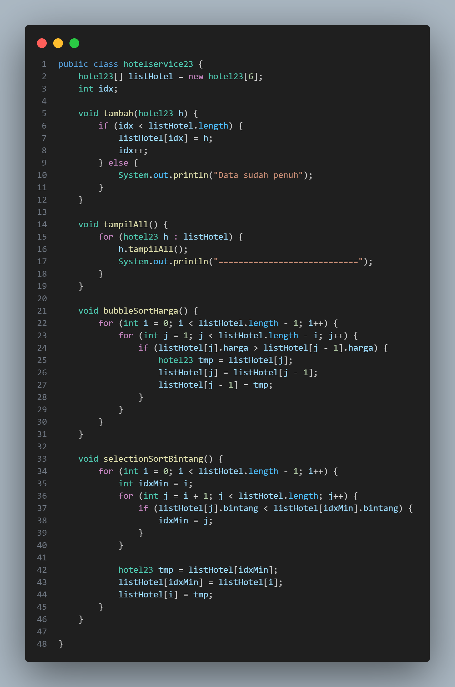
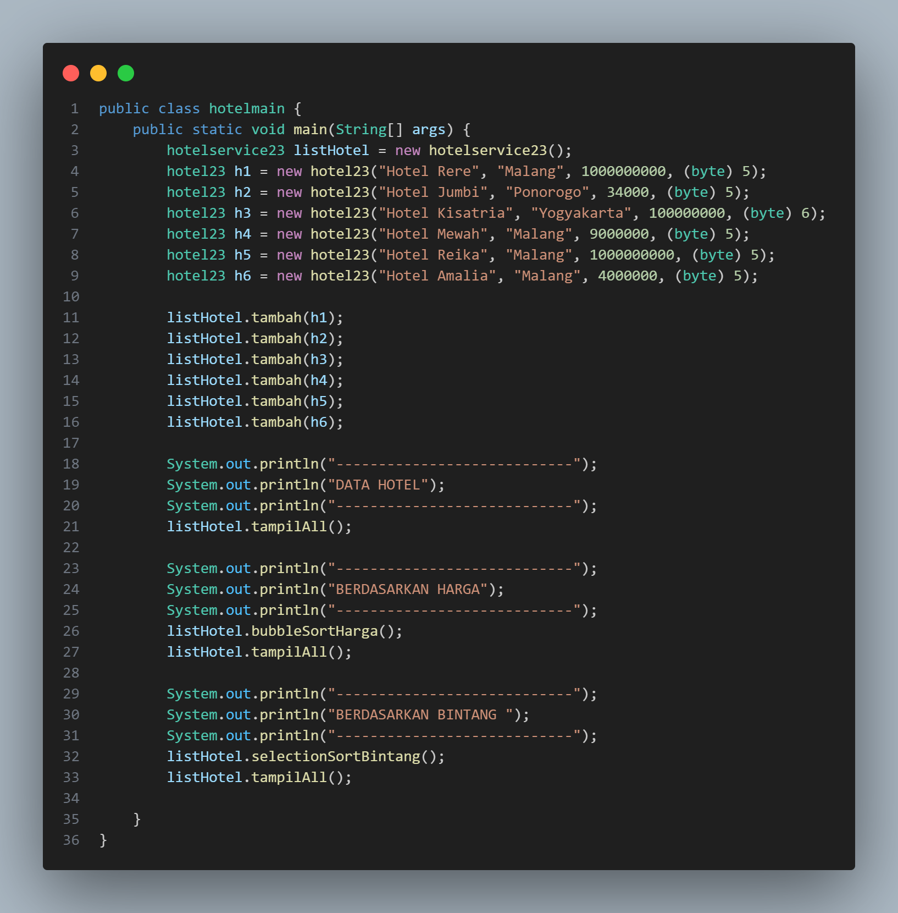
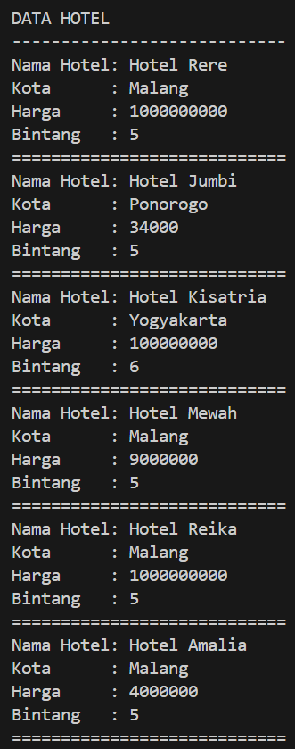
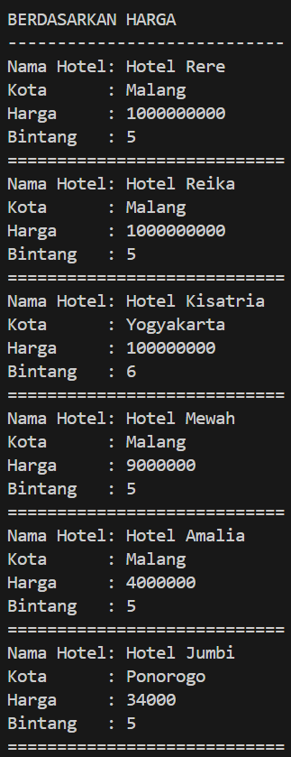
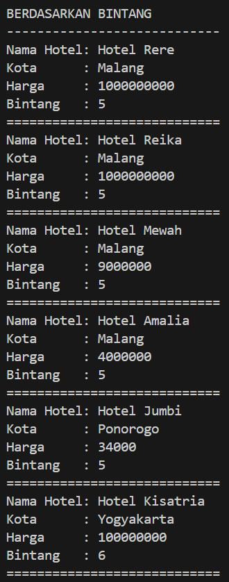

# 
 LAPORAN ALGORITMA DAN STRUKTUR DATA

     

     

 Nama       : REIKA AMALIA SYAHPUTRI 

 NIM        : 2341720173 

 Kelas / no : TI-1B / 23 

 Jurusan    : TEKNOLOGI INFORMASI 

## JOBSHEET - 5 SORTING (BUBBLE, SELECTION, DAN INSERTION SORT)

Percobaan 1

code:

 
 
 

output:

.png>) 

5.2.3 Pertanyaan
1. Terdapat di method apakah proses bubble sort? 
- pada method bubbleSort() di class MahasiswaBerprestasi 
2. Di dalam method bubbleSort(), terdapat baris program seperti di bawah ini:
Untuk apakah proses tersebut? 
- untuk membandingkan nilai IPK (indeks prestasi kumulatif) dari dua elemen berturut-turut dalam array listMhs yang berisi objek Mahasiswa
3. Perhatikan perulangan di dalam bubbleSort() di bawah ini: 
a. Apakah perbedaan antara kegunaan perulangan i dan perulangan j? 
- jika perulangan i untuk mengiterasi dalam setiap elemen dalam array listMhs. Perulangan ini juga memastikan semua elemen dapat dibandingkan dengan elemen setelahnya.
jika perulangan j untuk mengontrol berapa kali perbandingan dan penukaran elemen dilakukan dan berhenti jika tidk ada lagi elemen yg perlu ditukar (ketika array sudah urut) 
b. Mengapa syarat dari perulangan i adalah i<listMhs.length-1 ?
 
- karena setiap iterasi i mewakili satu langkah pembubble-an 
c. Mengapa syarat dari perulangan j adalah j<listMhs.length-i ? 
 
- karena setiap iterasi j memperkecil jangkauan elemen yang perlu dipertimbangkan 
d. Jika banyak data di dalam listMhs adalah 50, maka berapakali perulangan i akan berlangsung? Dan ada berapa Tahap bubble sort yang ditempuh? 
- perulangan i akan berlangsung 50 sampai 1 (49 kali). karena bubble sort akan berhenti ketika array sudah terurut.

percobaan 2
code:

 
 

output:
.png>) 

5.3.3. Pertanyaan
Di dalam method selection sort, terdapat baris program seperti di bawah ini:
Untuk apakah proses tersebut, jelaskan! 
- untuk mencari nilai ipk terkecil dari array listMhs dengan membandingkan antar index array.

percobaan 3:

code:

 
 

output:

.png>) 

5.4.3 Pertanyaan
Ubahlah fungsi pada InsertionSort sehingga fungsi ini dapat melaksanakan proses sorting
dengan cara descending. 
- void insertionSortDescending() {
        for (int i = 1; i < listMhs.length; i++) {
            Mahasiswa23 temp = listMhs[i];
            int j = i;
            while (j > 0 && listMhs[j - 1].ipk > temp.ipk) {
                listMhs[j] = listMhs[j - 1];
                j--;
            }
            listMhs[j] = temp;
        }
    }

5.5 Latihan Praktikum

Sebuah platform travel yang menyediakan layanan pemesanan kebutuhan travelling sedang
mengembangkan backend untuk sistem pemesanan/reservasi akomodasi (penginapan), salah
satu fiturnya adalah menampilkan daftar penginapan yang tersedia berdasarkan pilihan filter
yang diinginkan user. Daftar penginapan ini harus dapat disorting berdasarkan
1. Harga dimulai dari harga termurah ke harga tertinggi.
2. Rating bintang penginapan dari bintang tertinggi (5) ke terendah (1)
Buatlah proses sorting data untuk kedua filter tersebut dengan menggunakan algoritma
bubble sort dan selection sort. 

code : hotel  
 
code : hotel service  
 
code main :  
 

output: 
 
 
 