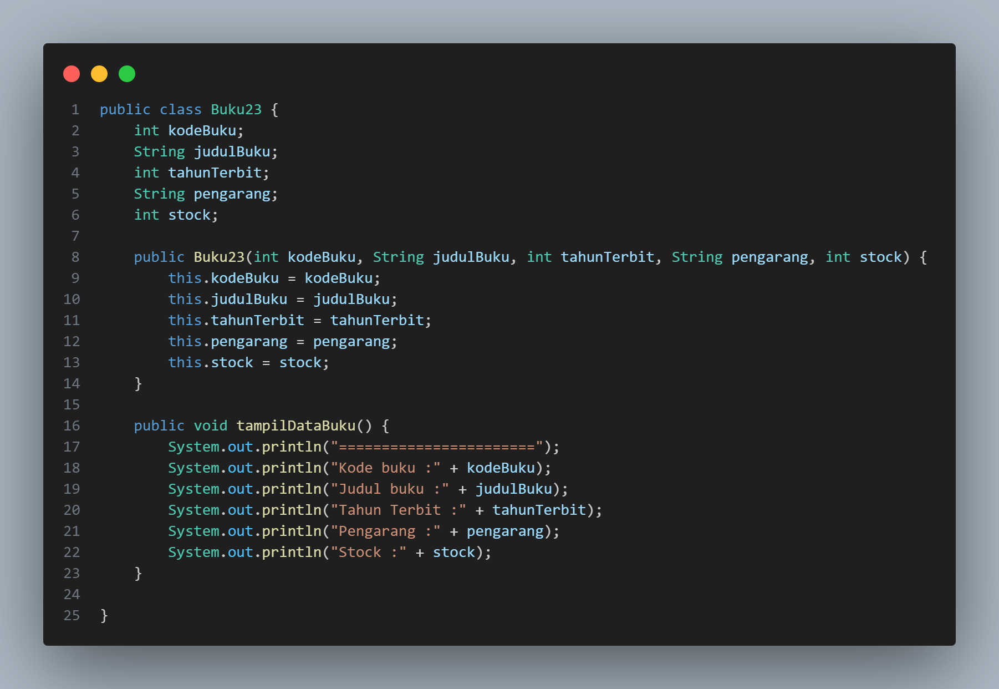
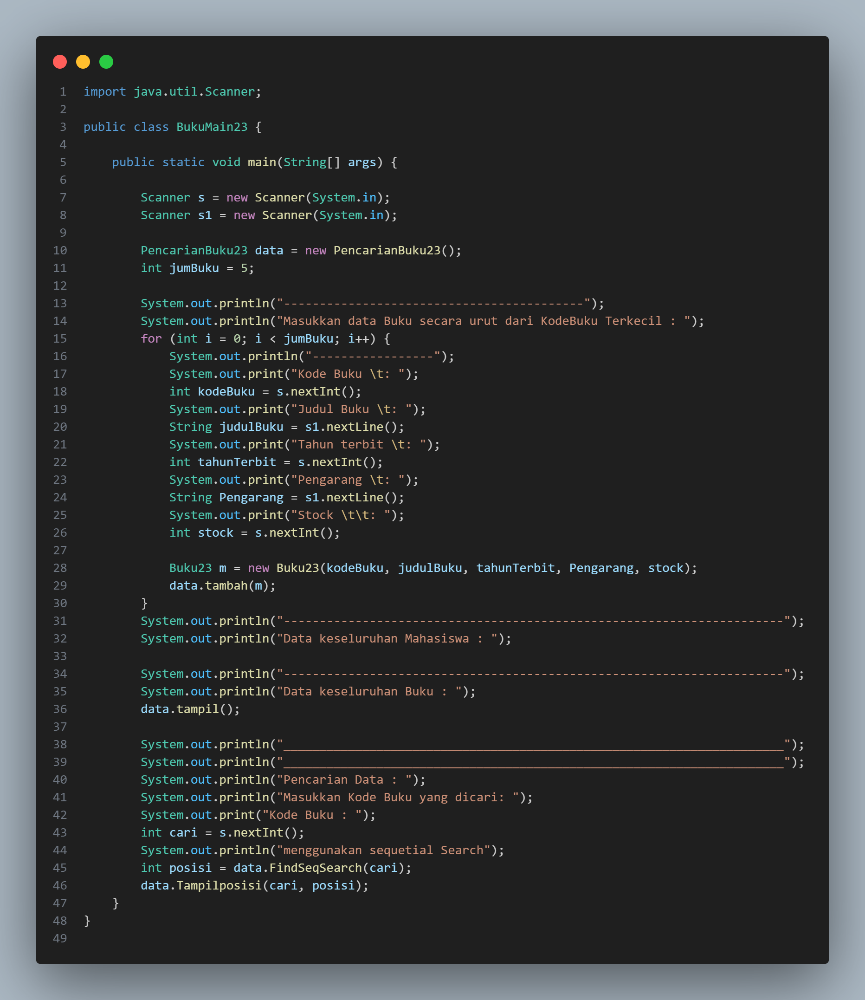
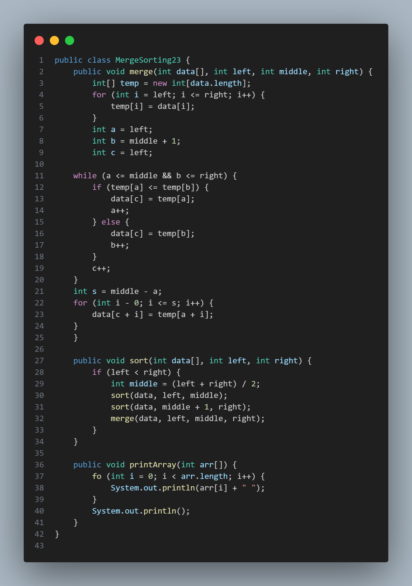
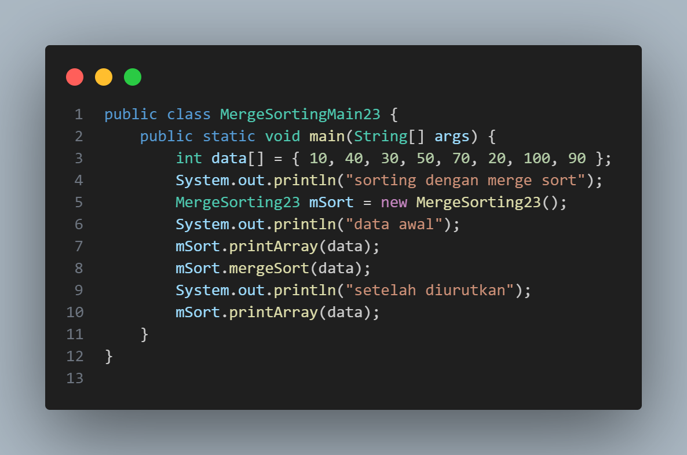

# 
 LAPORAN ALGORITMA DAN STRUKTUR DATA

     

     

 Nama       : REIKA AMALIA SYAHPUTRI 

 NIM        : 2341720173 

 Kelas / no : TI-1B / 23 

 Jurusan    : TEKNOLOGI INFORMASI 

## JOBSHEET VI SEARCHING

code : 
 
 
 
output: 
 

code: 
 
output: 
 

6.2.3. Pertanyaan
1. Jelaskan fungsi break yang ada pada method FindSeqSearch! 
- Fungsinya yaitu menghentikan perulangan ketika menemukan nilai cari pada kumpulan atribut kode buku di array of object 
2. Jika Data Kode Buku yang dimasukkan tidak terurut dari kecil ke besar. Apakah program masih
dapat berjalan? Apakah hasil yang dikeluarkan benar? Tunjukkan hasil screenshoot untuk bukti
dengan kode Buku yang acak. Jelaskan Mengapa hal tersebut bisa terjadi? 
- program yang diberikan akan tetap berjalan meskipun data kode buku yang dimasukkan tidak terurut dari kecil ke besar 
3. Buat method baru dengan nama FindBuku menggunakan konsep sequential search dengan tipe
method dari FindBuku adalah BukuNoAbsen. Sehingga Anda bisa memanggil method
tersebut pada class BukuMain seperti gambar berikut : 
- public Buku23 FindBuku(int cari) {
        int posisi = -1;
        for (int j = 0; j < listBk.length; j++) {
            if (listBk[j].kodeBuku == cari) {
                posisi = j;
                break;
            }
        }
        return listBk[posisi];
    }

    Buku15 dataBuku = data.FindBuku(cari);
        dataBuku.tampilDataBuku();

6.3.1. Langkah-langkah Percobaan Binary Search

code: 
 
 
output: 
 

6.3.3. Pertanyaan
1. Tunjukkan pada kode program yang mana proses divide dijalankan!
-  if (right >= left) {
            mid = (left + right) / 2;
2. Tunjukkan pada kode program yang mana proses conquer dijalankan!
- if (cari == listBk[mid].kodeBuku) {
                return (mid);
            } else if (listBk[mid].kodeBuku > cari) {
                return FindBinarySearch(cari, left, mid +-1);
            } else {
                return FindBinarySearch(cari, mid + 1, right);
            }
3. Jika data Kode Buku yang dimasukkan tidak urut. Apakah program masih dapat berjalan? Mengapa
demikian! Tunjukkan hasil screenshoot untuk bukti dengan kode Buku yang acak. Jelaskan
Mengapa hal tersebut bisa terjadi? 
- Program masih akan berjalan meskipun data Kode Buku yang dimasukkan tidak urut. karena pencarian dilakukan baik dengan pencarian berurutan (sequential search) maupun pencarian biner (binary search)  
4. Jika Kode Buku yang dimasukkan dari Kode Buku terbesar ke terkecil (missal : 20215, 20214,
20212, 20211, 20210) dan elemen yang dicari adalah 20210. Bagaimana hasil dari binary search?
Apakah sesuai? Jika tidak sesuai maka ubahlah kode program binary seach agar hasilnya sesuai! 
- 

6.4.1. Langkah-langkah Percobaan Merge Sort

code:  
 
code main: 
 
output: 

6.5. Latihan Praktikum
1. Modifikasi percobaan searching diatas dengan ketentuan berikut ini
 
- Ubah tipe data dari kode Buku yang awalnya int menjadi String
- Tambahkan method untuk pencarian kode Buku (bertipe data String) dengan menggunakan
sequential search dan binary search.

2. Modifikasi percobaan searching diatas dengan ketentuan berikut ini 

- Tambahkan method pencarian judul buku menggunakan sequential search dan binary
search. Sebelum dilakukan searching dengan binary search data harus dilakukan pengurutan
dengan menggunakan algoritma Sorting (bebas pilih algoritma sorting apapun)! Sehingga
ketika input data acak, maka algoritma searching akan tetap berjalan
- Buat aturan untuk mendeteksi hasil pencarian judul buku yang lebih dari 1 hasil dalam
bentuk kalimat peringatan! Pastikan algoritma yang diterapkan sesuai dengan kasus yang
diberikan!