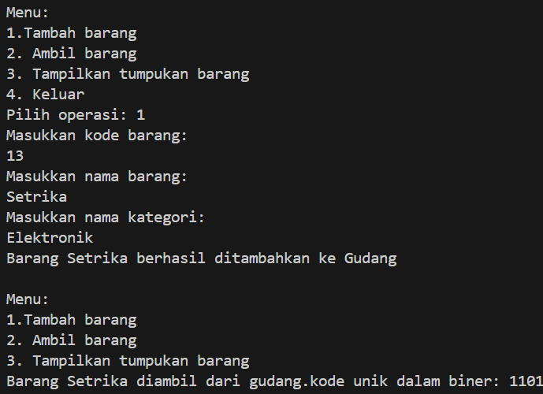

# 
 LAPORAN ALGORITMA DAN STRUKTUR DATA

     

     

 Nama       : REIKA AMALIA SYAHPUTRI 

 NIM        : 2341720173 

 Kelas / no : TI-1B / 23 

 Jurusan    : TEKNOLOGI INFORMASI 

## JOBSHEET VII STACK

Percobaan 1

code barang: 
public class Barang23 {
    int kode;
    String nama, kategori;

    Barang23(int kode, String nama, String kategori) {
        this.kode = kode;
        this.nama = nama;
        this.kategori = kategori;
    }
}

code gudang: 
public class Gudang23 {
    Barang23[] tumpukan;
    int size, top;

    public Gudang23(int kapasitas) {
        size = kapasitas;
        tumpukan = new Barang23[size];
        top = -1;
    }

    public boolean cekKosong() {
        if (top == -1) {
            return true;
        } else {
            return false;
        }
    }

    public boolean cekPenuh() {
        if (top == size - 1) {
            return true;
        } else {
            return false;
        }
    }

    public void tambahBarang(Barang23 brg) {
        if (!cekPenuh()) {
            top++;
            tumpukan[top] = brg;
            System.out.println("Barang " + brg.nama + " berhasil ditambahkan ke Gudang");
        } else {
            System.out.println("Gagal! Tumpukan barang di Gudang sudah penuh");
        }
    }

    public Barang23 ambilBarang() {
        if (!cekKosong()) {
            Barang23 delete = tumpukan[top];
            top--;
            System.out.println("Barang " + delete.nama + " diambil dari gudang.");
            return delete;
        } else {
            System.out.println("Tumpukan barang kosong.");
            return null;
        }
    }

    public Barang23 lihatBarangTeratas() {
        if (!cekKosong()) {
            Barang23 barangTeratas = tumpukan[top];
            System.out.println("Barang teratas: " + barangTeratas.nama);
            return barangTeratas;
        } else {
            System.out.println("Tupukan barang kosong.");
            return null;
        }
    }

    public void tampilkanBarang() {
        if (!cekKosong()) {
            System.out.println("Rincian tumpukan barang di Gudang: ");
            for (int i = top; i >= 0; i--) {
                System.out.printf("Kode %d: %s (Kategori %s)\n", tumpukan[i].kode, tumpukan[i].nama,
                        tumpukan[i].kategori);
            }
        } else {
            System.out.println("Tumpukan barang kosong");
        }
    }
}

code utama: 
import java.util.Scanner;

public class Utama23 {
    public static void main(String[] args) {
        Gudang23 gudang = new Gudang23(7);
        Scanner sc = new Scanner(System.in);

        while (true) {
            System.out.println("\nMenu:");
            System.out.println("1.Tambah barang");
            System.out.println("2. Ambil barang");
            System.out.println("3. Tampilkan tumpukan barang");
            System.out.println("4. Keluar");
            System.out.print("Pilih operasi: ");
            int pilihan = sc.nextInt();
            sc.nextLine();

            switch (pilihan) {
                case 1:
                    System.out.println("Masukkan kode barang: ");
                    int kode = sc.nextInt();
                    sc.nextLine();
                    System.out.println("Masukkan nama barang: ");
                    String nama = sc.nextLine();
                    System.out.println("Masukkan nama kategori: ");
                    String kategori = sc.nextLine();
                    Barang23 barangBaru = new Barang23(kode, nama, kategori);
                    gudang.tambahBarang(barangBaru);
                    break;

                case 2:
                    gudang.ambilBarang();
                    break;

                case 3:
                    gudang.tampilkanBarang();

                case 4:
                    break;
                default:
                    System.out.println("Pilihan tidak valid. Silakan coba lagi.");
            }
        }

    }
}

output: 
 
2.1.3 Pertanyaan
1. Lakukan perbaikan pada kode program, sehingga keluaran yang dihasilkan sama dengan verifikasi
hasil percobaan! Bagian mana saja yang perlu diperbaiki?
- Barang23(int kode, String nama, String kategori) {
        this.kode = kode;
        this.nama = nama;
        this.kategori = kategori;
    }

    public Barang23 lihatBarangTeratas() {
        if (!cekKosong()) {

    public void tampilkanBarang() {
        if (!cekKosong()) {
            System.out.println("Rincian tumpukan barang di Gudang: ");
            for (int i = top; i >= 0; i--) {
                System.out.printf("Kode %d: %s (Kategori %s)\n", tumpukan[i].kode, tumpukan[i].nama,
                        tumpukan[i].kategori);
            }
        } else {
            System.out.println("Tumpukan barang kosong");
        }
    }
2. Berapa banyak data barang yang dapat ditampung di dalam tumpukan? Tunjukkan potongan kode
-  Barang23[] tumpukan;
    int size, top;

    public Gudang23(int kapasitas) {
        size = kapasitas;
        tumpukan = new Barang23[size];
        top = -1;
    }
programnya!
3. Mengapa perlu pengecekan kondisi !cekKosong() pada method tampilkanBarang? Kalau kondisi
tersebut dihapus, apa dampaknya?
- perlu, untuk memastikan bahwa tumpukan barang tidak kosong sebelum mencoba menampilkan isinya. Jika kondisi ini dihapus, maka akan terjadi kesalahan saat mencoba mengakses elemen dari tumpukan barang yang kosong, yang dapat menyebabkan program berhenti secara paksa saat runtime.
4. Modifikasi kode program pada class Utama sehingga pengguna juga dapat memilih operasi lihat
barang teratas, serta dapat secara bebas menentukan kapasitas gudang!
- Scanner sc = new Scanner(System.in);
  Gudang23 gudang = new Gudang23(7);

  case 4:
                    System.out.println("Program berakhir.");
                    System.exit(0);
                    break;

percobaan 2

code StackKonversi: 
public class StackKonversi {
    int size;
    int[] tumpukanBiner;
    int top;

    public StackKonversi() {
        this.size = 32; // asumsi 32 bit
        tumpukanBiner = new int[size];
        top = -1;
    }

    public boolean isEmpty() {
        return top == -1;
    }

    public boolean isFull() {
        return top == size - 1;
    }

    public void push(int data) {
        if (isFull()) {
            System.out.println("Stack penuh");
        } else {
            top++;
            tumpukanBiner[top] = data;
        }
    }

    public int pop() {
        if (isEmpty()) {
            System.out.println("Stack kosong.");
            return -1;
        } else {
            int data = tumpukanBiner[top];
            top--;
            return data;
        }
    }
}

code gudang: 
import java.io.StringReader;

public class Gudang23 {
    Barang23[] tumpukan;
    int size, top;

    public Gudang23(int kapasitas) {
        size = kapasitas;
        tumpukan = new Barang23[size];
        top = -1;
    }

    public boolean cekKosong() {
        if (top == -1) {
            return true;
        } else {
            return false;
        }
    }

    public boolean cekPenuh() {
        if (top == size - 1) {
            return true;
        } else {
            return false;
        }
    }

    public void tambahBarang(Barang23 brg) {
        if (!cekPenuh()) {
            top++;
            tumpukan[top] = brg;
            System.out.println("Barang " + brg.nama + " berhasil ditambahkan ke Gudang");
        } else {
            System.out.println("Gagal! Tumpukan barang di Gudang sudah penuh");
        }
    }

    public Barang23 ambilBarang() {
        if (!cekKosong()) {
            Barang23 delete = tumpukan[top];
            top--;
            System.out.println("Barang " + delete.nama + " diambil dari gudang.");
            System.out.println("kode unik dalam biner: " + konversiDesimalKeBiner(delete.kode));
            return delete;
        } else {
            System.out.println("Tumpukan barang kosong.");
            return null;
        }
    }

    public Barang23 lihatBarangTeratas() {
        if (!cekKosong()) {
            Barang23 barangTeratas = tumpukan[top];
            System.out.println("Barang teratas: " + barangTeratas.nama);
            return barangTeratas;
        } else {
            System.out.println("Tupukan barang kosong.");
            return null;
        }
    }

    public void tampilkanBarang() {
        if (!cekKosong()) {
            System.out.println("Rincian tumpukan barang di Gudang: ");
            for (int i = top; i >= 0; i--) {
                System.out.printf("Kode %d: %s (Kategori %s)\n", tumpukan[i].kode, tumpukan[i].nama,
                        tumpukan[i].kategori);
            }
        } else {
            System.out.println("Tumpukan barang kosong");
        }
    }

    public String konversiDesimalKeBiner(int kode) {
        StackKonversi stack = new StackKonversi();
        while (kode > 0) {
            int sisa = kode % 2;
            stack.push(sisa);
            kode = kode / 2;
        }
        String biner = new String();
        while (!stack.isEmpty()) {
            biner += stack.pop();
        }
        return biner;
    }

}

output: 
 

2.2.3 Pertanyaan
1. Pada method konversiDesimalKeBiner, ubah kondisi perulangan menjadi while (kode != 0),
bagaimana hasilnya? Jelaskan alasannya!
- public String konversiDesimalKeBiner(int kode) {
        StackKonversi stack = new StackKonversi();
        while (kode != 0) {
            int sisa = kode % 2;
            stack.push(sisa);
            kode = kode / 2;
        }
hasil sama dengan kondisi sebelumnya, dengan menghasilkan representasi biner dari bilangan desimal yang berikan.
2. Jelaskan alur kerja dari method konversiDesimalKeBiner!
- mengonversi bilangan desimal menjadi biner menggunakan stack. Dilakukan dengan membagi bilangan desimal dengan 2 secara berulang, dan menyimpan sisa pembagian dalam stack, lalu mengeluarkan sisa-sisa tersebut dari stack dan membentuk string biner.

percobaan 3

code: 
public class postfix23 {
    int n, top;
    char[] stack;

    public postfix23(int total) {
        n = total;
        top = -1;
        stack = new char[n];
        push('(');
    }

    public void push(char c) {
        top++;
        stack[top] = c;
    }

    public char pop() {
        char item = stack[top];
        top--;
        return item;
    }

    public boolean IsOperand(char c) {
        if ((c >= 'A' && c <= 'Z') || (c >= 'a' && c <= 'z') || (c >= 'O' && c <= '9') || c == ' ' || c == '.') {
            return true;
        } else {
            return false;
        }
    }

    public boolean IsOperator(char c) {
        if (c == '^' || c == '%' || c == '/' || c == '*' || c == '-' || c == '+') {
            return true;
        } else {
            return false;
        }
    }

    public int derajat(char c) {
        switch (c) {
            case '^':
                return 3;
            case '%':
                return 2;
            case '/':
                return 2;
            case '*':
                return 2;
            case '-':
                return 1;
            case '+':
                return 1;
            default:
                return 0;
        }
    }

    public String konversi(String Q) {
        String p = "";
        char c;
        for (int i = 0; i < n; i++) {
            c = Q.charAt(i);
            if (IsOperand(c)) {
                p = p + c;
            }
            if (c == '(') {
                push(c);
            }
            if (c == ')') {
                while (stack[top] != '(') {
                    p = p + pop();
                }
                pop();
            }
            if (IsOperator(c)) {
                while (derajat(stack[top]) >= derajat(c)) {
                    p = p + pop();
                }
                push(c);
            }
        }
        return p;
    }
}

code main: 
import java.util.Scanner;

public class postfixmain23 {
    public static void main(String[] args) {
        Scanner sc = new Scanner(System.in);
        String P, Q;
        System.out.println("Masukkan ekspresi matematika (infix) : ");
        Q = sc.nextLine();
        Q = Q.trim();
        Q = Q + ")";
        int total = Q.length();
        postfix23 post = new postfix23(total);
        P = post.konversi(Q);
        System.out.println("Postfix: " + P);
    }
}

output: 
 

2.3.3 Pertanyaan
1. Pada method derajat, mengapa return value beberapa case bernilai sama? Apabila return
value diubah dengan nilai berbeda-beda setiap case-nya, apa yang terjadi?
- Maka urutan operator yang dihasilkan dalam ekspresi postfix dapat berubah sesuai dengan prioritas yang ditentukan dalam method derajat.
2. Jelaskan alur kerja method konversi!
- Untuk mengonversi ekspresi matematika dalam bentuk infix menjadi ekspresi postfix.
3. Pada method konversi, apa fungsi dari potongan kode berikut?
- c = Q.chartat(i); langkah untuk mengambil karakter berdasarkan indeks dalam string Q pada setiap iterasi loop.

Perhatikan dan gunakan kembali kode program pada Percobaan 1. Tambahkan dua method berikut pada class Gudang:
• Method lihatBarangTerbawah digunakan untuk mengecek barang pada tumpukan terbawah
• Method cariBarang digunakan untuk mencari ada atau tidaknya barang berdasarkan kode barangnya atau nama barangnya

code main:
import java.util.Scanner;

public class Utama23 {

    public static void main(String[] args) {
        Gudang23 gudang = new Gudang23(7);
        Scanner scanner = new Scanner(System.in);

        String nama = "";
        int kode = 0;

        System.out.print("Masukkan kapasitas gudang: ");
        int kapasitas = scanner.nextInt();
        scanner.nextLine();

        while (true) {
            System.out.println("\nMenu:");
            System.out.println("1. Tambah barang");
            System.out.println("2. Ambil barang");
            System.out.println("3. Lihat barang teratas");
            System.out.println("4. Lihat barang terbawah");
            System.out.println("5. Cari barang berdasarkan kode");
            System.out.println("6. Cari barang berdasarkan nama");
            System.out.println("7. Tampilkan tumpukan barang");
            System.out.println("8. Keluar");
            System.out.print("Pilih operasi: ");
            int pilihan = scanner.nextInt();
            scanner.nextLine();

            switch (pilihan) {
                case 1:
                    System.out.print("Masukkan kode barang: ");
                    kode = scanner.nextInt();
                    scanner.nextLine();
                    System.out.print("Masukkan nama barang: ");
                    nama = scanner.nextLine();
                    System.out.print("Masukkan nama kategori: ");
                    String kategori = scanner.nextLine();
                    Barang23 barangBaru = new Barang23(kode, nama, kategori);
                    gudang.tambahBarang(barangBaru);
                    break;
                case 2:
                    gudang.ambilBarang();
                    break;
                case 3:
                    gudang.lihatBarangTeratas();
                    break;
                case 4:
                    gudang.lihatBarangTerbawah();
                    break;
                case 5:
                    System.out.print("Masukkan kode barang: ");
                    kode = scanner.nextInt();
                    scanner.nextLine();
                    Barang23 barangDitemukan = gudang.cariBarangKode(kode);
                    if (barangDitemukan != null) {
                        System.out.println("Barang dengan kode " + kode + " ditemukan: " + barangDitemukan.nama);
                    } else {
                        System.out.println("Barang dengan kode " + kode + " tidak ditemukan.");
                    }
                    break;
                case 6:
                    System.out.print("Masukkan nama barang: ");
                    nama = scanner.nextLine();
                    barangDitemukan = gudang.cariBarangNama(nama);
                    if (barangDitemukan != null) {
                        System.out.println("Barang dengan nama " + nama + " dan kode " + kode + " ditemukan: "
                                + barangDitemukan.nama);
                    } else {
                        System.out.println("Barang dengan nama " + nama + " tidak ditemukan.");
                    }
                    break;
                case 7:
                    gudang.tampilkanBarang();
                    break;
                case 8:
                    System.out.println("Program berakhir.");
                    System.exit(0);
                    break;

                default:
                    System.out.println("Pilihan tidak valid. Silakan coba lagi.");
            }
        }
    }
}

code:
public class Gudang23 {

    Barang23[] tumpukan;
    int size, top;

    public Gudang23(int kapasitas) {
        size = kapasitas;
        tumpukan = new Barang23[size];
        top = -1;
    }

    public boolean cekKosong() {
        if (top == -1) {
            return true;
        } else {
            return false;
        }
    }

    public boolean cekPenuh() {
        if (top == size - 1) {
            return true;
        } else {
            return false;
        }
    }

    public boolean isEmpty() {
        return top == -1;
    }

    public void tambahBarang(Barang23 brg) {
        if (!cekPenuh()) {
            top++;
            tumpukan[top] = brg;
            System.out.println("Barang " + brg.nama + " berhasil ditambahkan ke Gudang");
        } else {
            System.out.println("Gagal! Tumpukan barang di Gudang sudah penuh");
        }
    }

    public Barang23 ambilBarang() {
        if (!cekKosong()) {
            Barang23 delete = tumpukan[top];
            top--;
            System.out.println("Barang " + delete.nama + " diambil dari Gudang.");
            System.out.println("Kode unik dalam biner: " + konversiDesimanlkeBiner(delete.kode));
            return delete;
        } else {
            System.out.println("Tumpukan barang kosong.");
            return null;
        }
    }

    public Barang23 lihatBarangTeratas() {
        if (!cekKosong()) {
            Barang23 barangTeratas = tumpukan[top];
            System.out.println("Barang teratas: " + barangTeratas.nama);
            return barangTeratas;
        } else {
            System.out.println("Tumpukan barang kosong.");
            return null;
        }
    }

    public Barang23 lihatBarangTerbawah() {
        if (!isEmpty()) {
            Barang23 barangTerbawah = tumpukan[0];
            System.out.println("Barang terbawah: " + barangTerbawah.nama);
            return barangTerbawah;
        } else {
            System.out.println("Tumpukan barang kosong.");
            return null;
        }
    }

    public Barang23 cariBarangKode(int kodeBarang) {
        for (int i = 0; i <= top; i++) {
            if (tumpukan[i].kode == kodeBarang) {
                return tumpukan[i];
            }
        }
        return null;
    }

    public Barang23 cariBarangNama(String namaBarang) {
        for (int i = 0; i <= top; i++) {
            if (tumpukan[i].nama.equals(namaBarang)) {
                return tumpukan[i];
            }
        }
        return null;
    }

    public void tampilkanBarang() {
        if (!cekKosong()) {
            System.out.println("Rician Tumpukan barang di Gudang:");
            for (int i = top; i >= 0; i--) {
                System.out.println(tumpukan[i].nama);
            }
        } else {
            System.out.println("Tumpukan barang kosong.");
        }
    }

    public String konversiDesimalkeBiner(int kode) {
        StackKonversi23 stack = new StackKonversi23();
        while (kode != 0) {
            int sisa = kode % 2;
            stack.push(sisa);
            kode = kode / 2;
        }
        String biner = new String();
        while (!stack.isEmpty()) {
            biner += stack.pop();
        }
        return biner;
    }
}